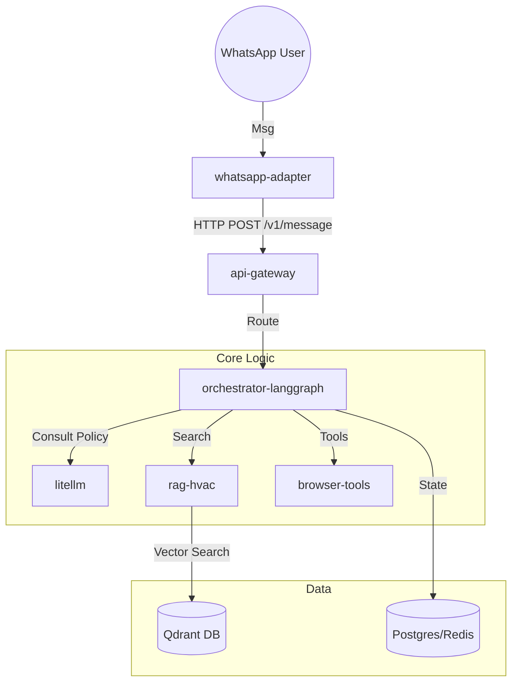

# Arquitetura do Sistema ZapPRO WhatsApp Bot (RAG HVAC)

## Visão Geral
Sistema multi-tenant para atendimento via WhatsApp com capacidade de RAG (Retrieval-Augmented Generation) especializado em manuais técnicos de HVAC (ar-condicionado, refrigeração).

## Diagrama de Serviços

## Componentes

1. **whatsapp-adapter**: Conexão com WhatsApp (Baileys ou Cloud API). Recebe webhooks e normaliza para formato interno.
2. **api-gateway**: Entrada única para o sistema. Autenticação, Rate Limiting (Token Bucket), Roteamento.
3. **orchestrator-langgraph**: Cérebro do sistema. Gerencia estado da conversa, decide tool calls, invoca RAG ou Browser.
   - Stack: Python + LangGraph.
4. **rag-hvac**: Serviço de ingestão e busca vetorial.
   - Ingest: PDF -> OCR -> Chunking -> Embedding -> Qdrant.
   - Query: Embedding -> Qdrant Search -> Rerank -> Context.
5. **browser-tools**: Automação de navegador para busca de manuais online ou interação com portais de fabricantes.
6. **litellm**: Proxy para LLMs (OpenAI, Anthropic, DeepSeek), gerenciando chaves, custos e fallbacks.

## Fluxo de Dados
1. Mensagem chega no `whatsapp-adapter`.
2. Enviada para `api-gateway` (/v1/message).
3. Gateway valida tenant e encaminha para `orchestrator`.
4. Orchestrator recupera histórico, define intenção.
5. Se técnica -> chama `rag-hvac`.
6. `rag-hvac` retorna trechos com metadata (pag, fig).
7. Orchestrator gera resposta com citações obrigatórias.
8. Resposta volta ao `whatsapp-adapter` -> Usuário.
